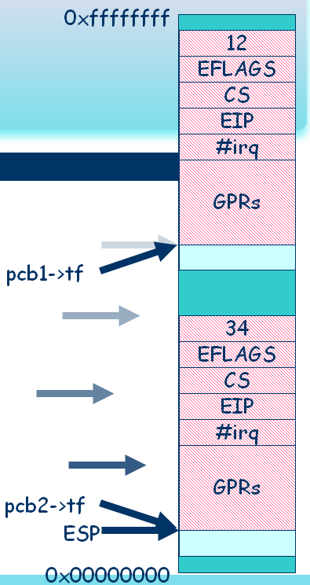
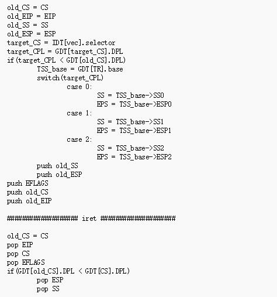

## 实验提交

截止时间: 2017/04/07 23:59:59 (如无特殊原因，截止时间后一周之内迟交的作业将损失50%的成绩(即使迟了 1 秒)，一周之后将不再接受任何形式的作业提交，请大家合理分配时间)

请大家在提交的实验报告中注明你的邮箱，方便我们及时给你一些反馈信息。

学术诚信: 如果你确实无法完成实验，你可以选择不提交，作为学术诚信的奖励，你将会获得10%的分数；但若发现抄袭现象，抄袭双方(或团体)在本次实验中得 0 分。

提交地址：http://cslabcms.nju.edu.cn/

提交格式: 你需要将整个工程打包上传，特别地，我们会清除中间结果重新编译，若编译不通过，你将损失相应的分数（请在报告中注明你实验所使用的 gcc 的版本，以便助教处理一些 gcc 版本带来的问题）. 我们会使用脚本进行批量解压缩. 压缩包的命名只能包含你的学号。另外为了防止编码问题，压缩包中的所有文件都不要包含中文.如果你需要多次提交，请先手动删除旧的提交记录(提交网站允许下载，删除自己的提交记录)，否则若脚本解压时出现多次提交相互覆盖的现象，后果自负.我们只接受以下格式的压缩包：

- tar.gz
- tar.bz2
- zip

若提交的压缩包因格式原因无法被脚本识别，后果自负。

请你在实验截止前务必确认你提交的内容符合要求(格式、相关内容等)，你可以下载你提交的内容进行确认。如果由于你的原因给我们造成了不必要的麻烦，视情况而定，在本次实验中你将会被扣除一定的分数，最高可达 50% 。

git 版本控制：我们建议你使用 git 管理你的项目，如果你提交的实验中包含均匀合理的 git 记录，你将会获得 10% 的分数奖励（请注意，本实验的 Makefile 是由你自己准备的，你可以选择像 PA 中一样在每一次 make 后增加新的 git 记录作为备份，但是请注意，这样生成的 git log 一般是无意义的，所以不能作为加分项）。为此，请你确认提交的压缩包中包含一个名为 .git 的文件夹。

实验报告要求：仅接受 pdf 格式的实验报告，不超过 5 页 A4 纸，字号不能小于五号（10.5 磅，或 3.7 毫米），尽可能表现出你实验过程的心得，你攻克的难题，你踩的不同寻常的坑。

注意：本次实验有一些需要回答问题，你需要在实验报告的开头回答这些问题，然后再谈论自己的心得。


分数分布：
- 实验主体：70%
- 实验报告：30%

解释：
1. 每次实验最多获得满分；
1. git 的分数奖励是在实验主体基础上计算的
1. git 记录是否“均匀合理”由助教判定；
1. 迟交扣除整个实验分数的 50% ；
1. 作弊扣除整个实验分数的 100% ；
1. 提交格式不合理扣除整个实验分数的一定比例；
1. 保留未解释细节的最终解释权；

## 实验目的

在第二次实验里，我们将实现系统调用机制并将游戏切换到用户空间加载执行。

## 系统调用

### 机制

在 ICS 课程中，我们已经学习过关于系统调用的一些基本概念了。
在 x86 体系下，系统调用的基本流程是：

1. 往约定的寄存器中写入系统调用号以及系统调用需要的参数；
2. 然后通过预留的中断号，用软件中断的方式陷入内核；
3. 在内核中通过陷阱帧识别系统调用及其参数，进行相应处理；
4. 中断返回。

设计系统调用，需要确定用来进入系统调用处理函数的中断号，以及具体系统调用号的分配和参数约定。
你可以像 PA 里那样，或者说像 Linux 里那样，使用 0x80 作为中断号，使用 eax 作为系统调用号所在的寄存器，
当然，你也可以有自己的设计。你甚至可以为每一个系统服务分配独立的中断号，这样你还可以多出一个寄存器用来传参数。

### 需求

有需求才有实现的动力，那么我们为什么需要系统调用？

现在，我们的游戏和内核是编译成一个可执行文件的。
游戏代码可以引用内核所有的外部符号，本质上可以直接修改物理内存，可以直接获取硬件资源。
由于这两份代码都是你自己编写的，你能把握住分寸，甚至会喜欢这种自由的感觉（对比一下直接读写显存和使用 SDL 的 API）。
但是，一个实际的内核要服务于各种各样的程序，谁能保证从磁盘读出来的程序是安分守己的呢？
再者，在多任务的场景下，为了协调各个进程对硬件资源的使用，更是不能让用户程序自己直接控制硬件资源。
所以，为了加强管理，我们要在内核和用户之间划一道明确的界限，这个界限由特权级和地址空间组成。
当然用户程序不是说不能使用硬件资源了，只是使用的时候要通知内核代为执行，而通知内核的方法，便是系统调用。

我们已经知道系统调用的一个基本功能是屏蔽用户对硬件资源的直接访问。
作为终将被扔到用户空间的游戏，我们来清点下它对硬件资源有哪些需求：

1. 串口输出(printf)
2. 写显存(printf,initScreen,...)
3. 读键盘码(readKey)

如果你使用标准 VGA 模式，并且有修改调色板的需求，那也不能例外。

所以，现阶段系统调用的需求就很明确了，你需要将至少上面那三个功能封装成系统调用的模式，具体你的系统调用要做什么，请根据你的游戏内容自行设计。
至于怎么分配系统调用号，参数如何传递，可以有自己的设计。

### 目标

这里我们再明确下要做的工作：

1. 填写中断描述符表，增加系统调用处理例程，或者修改通用中断处理函数，发现中断是系统调用时跳转到系统调用处理函数；
2. 将处理硬件（串口、显存、键盘）的代码移入对应的系统调用处理函数中；
3. 封装系统调用接口（系统原语），用原语替换游戏代码中对应功能的部分代码；
4. 测试游戏是否能和原来一样正常运行。

注意，只有游戏需要使用系统调用，内核可以直接使用系统调用的处理函数来完成相同的功能。

## 用户程序

多任务场景下，隔离各个进程最重要的机制便是虚拟存储空间。在这一部分，我们将介绍一种实现虚拟存储的方法。
最后，我们要将游戏代码和内核代码隔离，编译到不同的二进制文件。内核将在运行时加载游戏，并为游戏开辟虚拟空间，
最终让游戏运行在用户空间。

这里主要介绍使用非扁平的分段机制实现虚拟存储的方法，你也可以使用扁平模式 + 分页机制。

###上下文切换与用户程序的装载
将游戏代码和内核代码分离开后，我们的系统运行流程应该是 boot->kernel->game.
值得注意的是，我们的 kernel 和 game 是分别独立开来的，换句话说，系统满足的话，我们的 kernel 和 game 都是可以分别独立运行的程序，这两个程序实际上就对应着我们的操作系统和用户程序。开机后，我们用 boot 从磁盘中将 kernel 装载到内存中，然后跳转到了 kernel 的代码中。我们在 kernel 中完成了内核的一系列初始化操作，为用户程序的运行打下基础，然后我们就需要再次完成一次磁盘文件的装载，从磁盘文件中读取 game 的代码，然后再跳转到 game 中运行。**注意**，我们不能再像 boot 里面的做法一样，直接通过一个简单的跳转就进入到 game 中。我们简单来开个脑洞：我们的用户程序应该有相似的地址模式，这样我们的程序才能在不同的机器中通用。既然用户程序具有相似的地址模式，那么程序在系统中怎么放，放哪里，怎么跑应该是由系统（也就是内核）来决定的。操作系统的虚存管理便完成了这一类工作，让不同的程序能够同时运行而不会相互影响。我们先要对"同时"作一些解释. 你应该在理论课上听过"并发"和"并行"两个概念, 这里的"同时"指的是多个程序并发执行, 即 CPU 在不同的程序之间来回切换, 而且切换的间隔十分短, 这样给用户的感觉就像是"同时"运行一样. 因此, 对于单核计算机而言, "同时"只是一种假象。为了达到这种同时的效果，我们的系统需要能够完成上下文切换。回顾我们的 Lab1, 游戏是中断驱动的, 每当有外部中断到来, CPU 将会按照 IA-32 中断处理机制跳转到中断处理程序, 把现场的信息保存到堆栈上之后对中断进行处理, 然后根据之前保存的信息恢复现场, 最后从中断返回。我们只要对这个流程稍作修改，就能实现上下文切换： 

假设有两个程序A 和B, 在某一时刻, A 在运行, 这时中断到来了, CPU 将会跳转到中断处理部分的代码:

```asm
irq0: pushl $1000; jmp asm_do_irq
# other entry points for different interrupts and exceptions

asm_do_irq:
  pushal
  pushl %esp
  call irq_handle
  addl $4, %esp
  # switch %esp to other program
  popal
  addl $4, %esp
  iret
```

在 `asm_do_irq` 中, 代码将会把A的通用寄存器保存到A的堆栈上, 这些寄存器的内容连同之前保存的 #irq 和硬件保存的 EFLAGS, CS, EIP 形成了"陷阱帧"(trap frame)的数据结构, 它记录了 A 在中断到来之前的状态。注意到"陷阱帧"是在堆栈上的, 此时 `asm_do_irq` 将 A 的栈顶指针作为参数传给C函数 `irq_handle`. 神奇的地方来了，从 `irq_handle` 返回后，如果我们先不着急恢复 A 的现场，而是先将 ESP 寄存器切换到 B 的堆栈上，接下来的恢复现场操作将会恢复成 B 的现场：恢复 B 的通用寄存器，弹出 #irq, 恢复 B 的 EIP, CS, EFLAGS. 从中断返回之后，我们已经在运行程序 B 了!



那程序 A 到哪里去了呢？别担心，它只是被暂时挂起了而已。在被挂起之前, 它已经把现场的信息保存在自己的堆栈上了，如果将来的某一时刻 ESP 被切换到 A 的堆栈上，代码将会根据 A 之前保存的信息(A 的"陷阱帧")恢复 A 的现场，A 将得以唤醒并执行。
我们只需要保证 esp 切换后正好指向一个程序的陷阱帧，那么我们恢复现场之后就能够恢复到陷阱帧中保存的程序状态。这就是上下文切换的大致流程。然而这一切的前提是我们有一个正确的陷阱帧。在上下文切换中，我们的陷阱帧是程序之前挂起是保存起来的，因此能够保证陷阱帧的正确。但我们的应该如何成功地执行第一次上下文切换呢？简单来说就是在我们的内核中人为的填充一个陷阱帧，这个陷阱帧里面保存了我们的第一个程序的状态，然后，我们只要把栈指针指向这个自己填好的陷阱帧，然后执行恢复现场的操作，就可以"回到"这个程序的空间中，换句话说，就是完成了我们用户程序的装载。完成了这一个，我们就好像是解决了数学归纳法中的 base case, 此后无论有多少次中断，我们的系统都能够自动的保存用户程序的运行状态，恢复现场时就能够回到中断到来前的状态。用户程序实际上就已经跑在了我们的内核之上。

陷阱帧实际上是根据 x86 中断的硬件行为根据栈里面的内容模拟出来的一个结构，中断的硬件行为如下：



在 lab1 中，我们的中断都是在 ring 0 中的，因此我们的陷阱帧并不含有上面的所有内容，在引入用户程序后，我们的中断会有从 ring 3 返回 ring 0 的情况，此时涉及到堆栈的切换，因此我们的栈中还保存了ss, esp 等，我们的陷阱帧也应该据此改变。

你需要从下面提到的两种虚存管理方式中选择一种，然后在相应的机制下装载用户程序，填写这个进程的 PCB, 然后为这个新程序初始化一个陷阱帧，里面存放了进程的上下文信息（其实就是寄存器的值），最后只要使用这个陷阱帧恢复现场，我们就会完美的切换到用户程序的初始状态，然后就能跑起来了。至于如何初始化我们的陷阱帧，请根据你对虚存管理的理解自行填写。

### 远古副本

一直以来，你都生活在80386建立的页式存储管理的新时代中。
你的~~历史~~老师总是会和你说，当年，还有一种叫做段式存储管理的东西，它有种种的缺点（努力回忆），因此它已经被淘汰了。
说是淘汰，其实段式存储依然苟活于 x86 的存储管理中，只不过，正常情况下，通过扁平模式的方法绕过了分段。

扁平模式的做法是：将段基地址设置成 0，长度设置成 4GB，这样虚拟地址和分段之后得到的线性地址就一样了。
扁平模式对于探索存储管理的你来说，称之为温室绝不为过。
说一千道一万，不如自己走进分段探索一番，只有亲自面对了分段管理中遇到的各种问题，才能深刻的理解段页式存储中隐藏的智慧。
如果你觉得一直和分页管理打交道没有意思，欢迎你走进远古副本，逆天而行。

### 准备

也许你会说，之前你已经了解过分段管理中寄存器，段描述符，段选择符等等的作用了，快开车吧。
*不不不*，相信我，你还没准备好，为了能更好地用这些设施来实现你对存储管理的想法，请仔细地看好它们每一个域的作用。


### 段描述符

80386 把一个段的各种属性放在一起, 组成一个段描述符。
所谓段描述符，就是用来描述一个段的属性的数据结构，如果能有办法找到一个段描述符，就可以找到相应的段了。
一个用于描述代码段和数据段的段描述符结构如下:

```
	DESCRIPTORS USED FOR APPLICATIONS CODE AND DATA SEGMENTS

   31                23                15                7               0
   +-----------------+-+-+-+-+---------+-+-----+-+-----+-+-----------------+
   |                 | | | |A|         | |     | |     | |                 |
   |   BASE 31..24   |G|X|O|V| LIMIT   |P| DPL |1| TYPE|A|  BASE 23..16    | 4
   |                 | | | |L| 19..16  | |     | |     | |                 |
   |-----------------+-+-+-+-+---------+-+-----+-+-----+-+-----------------|
   |                                   |                                   |
   |        SEGMENT BASE 15..0         |       SEGMENT LIMIT 15..0         | 0
   |                                   |                                   |
   +-----------------------------------+-----------------------------------+


	DESCRIPTORS USED FOR SPECIAL SYSTEM SEGMENTS

   31                23                15                7               0
   +-----------------+-+-+-+-+---------+-+-----+-+-----+-+-----------------+
   |                 | | | |A|         | |     | |     | |                 |
   |   BASE 31..24   |G|X|O|V| LIMIT   |P| DPL |0| TYPE|A|  BASE 23..16    | 4
   |                 | | | |L| 19..16  | |     | |     | |                 |
   |-----------------+-+-+-+-+---------+-+-----+-+-----+-+-----------------|
   |                                   |                                   |
   |        SEGMENT BASE 15..0         |       SEGMENT LIMIT 15..0         | 0
   |                                   |                                   |
   +-----------------------------------+-----------------------------------+

	A      - ACCESSED
	AVL    - AVAILABLE FOR USE BY SYSTEMS PROGRAMMERS
	DPL    - DESCRIPTOR PRIVILEGE LEVEL
	G      - GRANULARITY
	P      - SEGMENT PRESENT

```

每个位域的详细作用请移步 i386 手册第 5 章。在这里需要额外补充的是 TYPE 位域的编码：

```
USEFUL TYPE FOR APPLICATION SEGMENTS:
READ/WRITE DATA SEGMENT:	0X02
EXECUTABLE CODE SEGMENT:	0X0A 

GENERALLY:
	TYPE:
	bit3:	0(data)							1(code)
	bit2:	0(normal)						1(expand-down)
	bit1:	0(read-only/execute-only)		1(rw / readable)
	bit0:	0(hasn` t been accessed)		1(accessed)

TYPE FOR SYSTEM SEGMENTS:
0x1		AVAILABLE 16-BIT TSS
0X2		LOCAL DESCRIPTOR TABLE
0X3		BUSY 16-BIT TSS
0X4		16-BIT CALL GATE
0X5		TASK GATE
0X6		16-BIT INTERRUPT GATE
0X7		16-BIT TRAP GATE
0X9		ABAILABLE 32-BIT TSS
0XB		BUSY 32-BIT TSS
0XC		32-BIT CALL GATE
0XE		32-BIT INTERRUPT GATE
0XF		32-BIT TRAP GATE

```

### 段选择符

在保护模式下，段寄存器用来存放段描述符的索引，其中还包含了一些属性：

```
	15                        3 2   0
    +-------------------------+-+---+
	|                         |T|   |
	|           INDEX         | |RPL|
	|                         |I|   |
	+-------------------------+-+---+

	TI  - TABLE INDICATOR
	RPL - REQUESTOR`S PRIVILEGE LEVEL
```

其中TI决定使用GDT(TI = 0)还是LDT(TI = 1)来查找描述符，RPL则指示了请求者的权限。

### 描述符表

经过了上学期的PA，相信你肯定知道段描述符是以数组的形式存放于内存中的。
我们有两种类型的描述符表：GDT 和 LDT。
在扁平模式下，由于弱化了分段的使用，因此LDT通常不会使用。在我们的远古副本中，也许你会找到机会使用 LDT，因此我们会一并介绍。

一般来说，通过 GDTR 和 LDTR 可以获得对应的描述符表地址，然后通过选择符的索引即可得到对应的描述符。
我们需要在初始化的时候通过 LGDT 和 LLDT 初始化我们的 GDT 和 LDT。这里有一个问题：实际上 LDTR 存放的是 LDT 段在 GDT 中的索引。
换句话来说，LDTR的作用和段寄存器的作用是差不多的，因此初始化 LDT 和 GDT 的方式是不一样的。
初始化 GDT 时，我们在内核中定义一个描述符数组，填写描述符数组后调用 LGDT 即可；
而初始化 LDT 则需要额外在 GDT 中添加一个描述符，这个描述符指向了你刚才定义的 LDT 所在的段，然后用 LLDT 指令将对应的选择符载入到 LDTR 中。
更加具体的内容请参考 i386 手册中对 LGDT 和 LLDT 的介绍。

### 小结

在 LAB1 中你已经使用过了 32 位的中断门和陷阱门用于初始化中断描述符表。
在 LAB2 中，为了实现加载用户程序，你会需要为用户程序初始化一个全局描述符表，其中会需要记录内核的段、TSS、以及**可能**会用到的 LDT，
这取决于你是否启用 LDT（你可以用很多的全局描述符代替 LDT 的作用）。

我们已经知道，每个段描述符都记录了对应段的基地址，界限以及其他一些属性。
段式存储管理，正如你想象的那样，只要脱离扁平模式即可，
没错，事情就是这么简单，但实际上也没那么简单，在这个过程中我们会不断地遇到抛弃扁平模式后带来的不便。
如果你已经做好准备，请继续：

### 地址划分

要完成存储管理，这个是需要你认真思考的问题，近的来说，关系到你实现的难易程度，远的来说，关系到你的系统拓展的难易程度。

> **明确一点：从现在开始，我们的游戏已经从内核中分离出来。建议你将游戏的代码独立于kernel文件夹的地方，然后在Makefile中添加相应的规则**

首先我们需要给我们的内核指定一定的空间，在此我们建议你将划分的地址空间单位大小定义为宏，这样便于在后续实验中调整。
在这里，建议你搭上顺风车，让内核就跑在从 0 开始的物理地址中，至于为什么，你可以思考如果不这么干应该怎么做。
分配完内核的空间，剩下的空间我们就可以分配给我们的用户程序。
在此之前我们先来看看程序所需要的段，在PA中我们已经看过，文件的代码被划分为多个段保存在文件中。
对任何一个可执行文件，你可以使用 `readelf -l` 命令来查看这个文件的段。
在实验中我们需要关注的主要可装载的段，一般为只读段和读写段，还有一个比较关键的是栈。
代码相对而言比较简单，都存在只读段中，而程序中的数据则相对而言需要考虑多种情况：

- 只读数据：存在于只读数据段中，一般紧跟在代码段后面，一起放在只读的段内
- 全局变量：存在于读写段中
- 局部变量：存在于栈内
- 动态存储变量：存在于堆中(不要求你实现malloc和free，所以不考虑堆区)

为什么我们需要考虑这些？很重要的原因是：
**系统调用过程中如果涉及到指针的传送，由于段式存储的特点，我们需要知道指针对应的段到底是哪一个，这样我们才能获取对应的基地址**。
到了这里，请你仔细思考为什么扁平模式下我们不需要考虑这个问题。

为了避免在系统调用陷入内核后不知道应该使用用户的哪一个段选择符来寻址（CS, DS, SS)，
我们可以从扁平模式中获取灵感，让 CS, DS, SS 都有相同的基地址，这样我们就可以从三个段选择符中任意选择一个来寻址了。
进一步简化，我们再选用相同的界限，这样我们的 CS, DS, SS 就会指向同一个段。
有一点需要注意的是，虽然我们的三个选择符寻址后指向相同的基地址，但是，我们需要给描述符设置对应的TYPE值，否则运行的时候会发生异常。
细心的你已经发现，我们的做法其实跟扁平模式没什么大区别，只是每个程序有个不同的基地址，我可以~~厚颜无耻地~~跟你说：没错，就是没什么大区别。
我们的程序的物理地址最终就是段基址加上虚拟地址。通过段描述符的基地址和界限，我们成功地将内核、每个用户程序分配到了不同的地址中。
这么做的另一个重要的原因是：
我们的程序在编译链接的时候是默认扁平模式的，因此不会考虑指针与所属的段的问题，并且所有的段地址是连续的。
如果 CS, DS 的基地址不一样的话，第二个载入的段地址就需要偏移。

举个例子，
有两个可装载段，第一个虚拟地址为 0x0 ~ 0xfff，第二个地址为 0x1000 ~ 0x1fff。
为第一个段分配的物理地址为 PH\_A，那么我们的第一个段占用 PH_A ~ PH_A + 0xfff，
然后我们给第二个段分配的首地址为 PH_A + 0x1000，为了使得运行过程中地址转换正确，我们就需要第二个段的虚拟地址全部减去 0x1000，
只有这样才能得到正确地址。

经过讨论，我们发现还是将代码段，数据段，栈都放到一个段里比较好，虽然这样会比较危险（用户栈向下增长时会将我们的代码和数据冲掉），
但这是目前最实际的实现方法了。
在这里请思考段页式存储是如何解决这个问题的。


### 内核初始化

为了让我们的内核能够装载用户程序，我们需要做相应的准备工作,这些工作包括但不限于：

- 初始化 GDT
- 填写内核代码、数据的段描述符
- 填写 TSS
- 初始化地址信息
- 初始化 PCB

#### GDT

我们已经知道 GDT 在内存中，因此需要在内核中分配一段空间用来存放，只需要简单粗暴的一个数组就好。注意分配足够大的空间来满足你的运行需求。
对于暂时为空的描述符，请根据手册介绍为其初始化。
填写好内核的描述符后，通过 lgdt 指令将这个数组的信息保存到 gdtr 中。
需要注意的是你需要保证内核描述符的索引与当前选择符的索引一致，否则 lgdt 后你的系统就会崩掉了。
初始化完成后，我们已经有了一个可供系统使用的描述符表，其中有许多空位等待用户程序填写。
你需要想办法提供接口，能够将新的段描述符填入这个数组，后面可能需要删除某个已经存在的段描述符中。
可以根据未来的需求简化这个接口（例如：你觉得后面你只需要添加用户程序的段描述符的话，只需要提供这一种接口即可）

#### TSS

x86 借助 TR 和 TSS 来完成任务切换。

TR (Task state segment Register) 是任务状态段寄存器, 它是一个 16 位的寄存器，
结构和 CS, DS, SS 这些段寄存器完全一样，它存放了 GDT 或 IDT 的一个索引，通过 TR 可以在 GDT 或 IDT 中找到一个 TSS 段描述符。

TSS (Task State Segment) 是任务状态段, 其结构如下图所示：


TSS 和代码段，数据段不同，是一个有特殊作用的段。
它用于存放任务的状态（现场）信息，主要用在硬件上下文切换。TSS 还提供了 3 个堆栈位置（包括 SS 和 ESP）。
当发生堆栈切换的时候，CPU 将根据目标代码特权级的不同，从TSS中取出相应的堆栈位置信息进行切换。
例如我们的中断处理程序位于 ring0，因此 CPU 会从 TSS 中取出 SS0 和 ESP0 进行切换。
为了让硬件在进行堆栈切换的时候可以找到新堆栈，内核需要将新堆栈的位置写入TSS的相应位置。
TSS 中的其它内容主要在硬件上下文切换中使用, 在我们的实现中，主要通过软件实现上下文切换，因此 TSS 中的大部分内容都不会使用。
我们需要用到的是其中的 SS0, ESP0 两个域，当用户程序通过中断陷入内核时，会通过硬件先切换到内核的堆栈，然后我们就可以在内核的堆栈中完成中断处理。
TSS的结构可以在手册中找到，**你只需记住，TSS 里面存放着用户程序内核栈的信息**。

#### 地址信息

也许你已经把系统的空间划分记在了心里，但是你的系统对其一无所知。
请自行设计相关的结构用来保存系统中空闲地址的信息，这样当新的用户程序需要分配地址空间的时候，才能依据现有空间获取。虽然现在我们还不需要实现进程的消亡，但是请注意，**你设计的结构应该能够回收消亡进程不会再使用的空间**。


#### 初始化 PCB

为了方便对进程进行管理，操作系统使用一种叫做进程控制块(Process Control Block, PCB)的数据结构，为每一个进程维护一个 PCB。
一个进程的 PCB 中一般包含上文提到的内容，但在目前的实验中，只需要为进程分配堆栈和上下文信息，就可以实现上下文切换了，PCB关键结构如下：

```C
#define KSTACK_SIZE 4096
struct PCB {
	void *tf;
	uint8_t kstack[KSTACK_SIZE];
};
```

你需要根据你的实际需要在 PCB 中添加其他数据域。由于上下文信息是保存在堆栈上的, 于是我们使用一个 TrapFrame 指针来指示上下文信息的位置。
在进行上下文切换的时候, 只需要把 PCB 中的 TrapFrame 指针的值赋给ESP寄存器即可，剩余部分的代码会根据上下文信息恢复现场。
你需要自行想办法初始化系统的 PCB，你可以参考 PA1 中断点池的思想，也可以简单粗暴用一个数组，这是你自己的系统，你自己喜欢就好。
同时你需要提供接口，能够方便地获取一个空闲的 PCB 用来填写新进程的信息，同时也要提供回收的方法。

### 加载用户程序

在这里我们可以把事情分成三步：

- 获取一个空的PCB并填写相关信息
- 装载用户程序并填写 PCB 中的信息
- 使用设计好的陷阱帧,通过 iret 切换到用户程序的空间

#### 陷阱帧初始化特别注意事项

- 通用寄存器esp
- cs,ds,ss需要根据分配的段描述符初始化
- eflags,尤其注意IF位
- eip，中断返回现场，请你自行思考应该设置为哪个值

#### 装载用户程序

这部分其实和 boot 的部分是非常相像的，如果你已经理解了我们的磁盘的生成模式，
我想你已经想到应该如何做才能找到我们的用户程序**（确保你的游戏已经从内核分离出来）**。

在这里我们提供一份脚本，可以将内核填充为 100KB 固定大小的文件，这样我们就可以确保用户程序在磁盘中的位置是 100KB + 512B。

```perl
#!/usr/bin/perl

open(SIG, $ARGV[0]) || die "open $ARGV[0]: $!";

$n = sysread(SIG, $buf, 100*1024);

if($n > 100 * 1024){
  print STDERR "ERROR:Kernel binary file too large:\
	  $n bytes (max 102400)\n";
  exit 1;
}

print STDERR "Kernel binary file is $n bytes (max 102400)\n";

$m = $n % (512);
$s = 512 - $m;
$p = 102400 - $n;

print STDERR "Kernel binary file size n = $n\n";
print STDERR "Kernel binary file sectors num m = $m\n";
print STDERR "Kernel binary file added $p bytes s = $s\n";

$buf .= "\0" x $p;


open(SIG, ">$ARGV[0]") || die "open >$ARGV[0]: $!";
print SIG $buf;
close SIG;


open(SIG, $ARGV[0]) || die "open $ARGV[0]: $!";

$n = sysread(SIG, $buf, 100*1024);

if($n > 100 * 1024){
  print STDERR "ERROR:Kernel binary file large: $n bytes (max 102400)\n";
  exit 1;
}

print STDERR "Kernel binary file is $n bytes (max 102400)\n";
print STDERR "*********************************************\n";
print STDERR "*********************************************\n";
print STDERR "*********************************************\n";
close SIG;
```

将这份代码保存下来，使用 `chmod +x 文件名` 之后就可以像普通程序一样使用了，输入参数为内核的二进制。
使用完后记得用 cat 或 dd 将用户程序的二进制拼上去。

然后使用 LAB1 的方法将用户程序拼接到内核的后面，我想如何读取用户程序的内容就不需要赘述了吧，~~偏移量的事~~。
关键在于如何将用户程序放到正确的位置，你需要先向内核索要一段空间，这个空间大小你自行决定
（可以每个程序一样，也可以根据程序大小动态划分~~我不会告诉你这样很麻烦的~~），获取这段空间的基地址，然后把磁盘中的内容读入到对应地址即可。
之后**千万**不要忘了填写陷阱帧中的段寄存器。

#### 返回用户空间

返回之前请确保你已经将这个进程的内核栈寄存器保存在 TSS 中，否则用户程序遇到中断后会无法切换到自己的内核栈中
（也许你该仔细地思考为什么每个进程都需要自己的内核栈）。
一切准备好了，你只需要将当前的esp指向陷阱帧，然后就开车吧,开始你的旅行。

#### 副本攻略须知

- gdb调试默认为扁平模式，在用户程序中输出变量会各种莫名其妙,很多时候你需要自行计算某个变量对应的物理地址。
- 注意系统调用时参数传送的寻址问题
- **我们在LAB2的中断中引入了硬件堆栈切换，之前的内核中断处理由于是同级中断，cpu不会进行硬件堆栈切换，简单来说就是你不能直接用 LAB1 的中断处理程序（应该是汇编写的？），需要根据你陷阱帧进行相应的调整，更重要的是错误码的引入！必读i386手册的第9章关于错误码的内容,这关系到你的用户程序能不能正常地从内核出来**
- 装载用户程序后你可能遇到 IRQ14（具体中断号是你的硬件中断偏移量 + 14），这个中断与硬盘相关，可以忽略，所以给它准备个空的处理例程吧。


~~发糖啦~~~~[这是糖果](http://162.211.224.221/images/sugars.tar)~~


### 目标

我们来明确下需要做的工作：

1. 分离内核和游戏，你要在 makefile 里准备两个独立的链接规则
2. 在内核里设计管理剩余物理内存的机制
3. 设置新的 GDT，并实现方便设置的接口（尝试使用 LDT？）
4. 设计并准备 PCB 结构体，准备用户内核栈
5. 准备好给用户的段描述符
6. 内核栈中伪造陷阱帧
7. 装载用户程序
8. 修改 esp 指向内核栈，按照伪造的陷阱帧中断返回


### 扁平模式+分页

虽然生物进化过程中，总会出现“个体重复系统发育”的情况（引自《现代操作系统》），但是历史的发展一般都是螺旋式上升的，并且每一次变化总是在
某种严重的问题或者是迫切的需求下发生的，目前扁平模式+分页的方式还没有出现致命的问题，所以它仍然是主流，被主流的工具链所接受，
所以选择它仍然是更为合理的。另外，OS的虚拟性的特点，在分页模式中也体现得更好。

如果选择扁平模式+分页，你可以将CS和DS的base初始化为0，limit初始化为~0，因为分段名存实亡，所以后面我们简称“分页”。

关于分页的知识，请查看i386手册和
[PA3](https://nju-ics.gitbooks.io/ics2015-programming-assignment/content/3.2.3.html)

下文的思路主要参考了jos，如果你选择了使用分页的方式，建议参考jos 
lab2的[讲义](https://pdos.csail.mit.edu/6.828/2014/labs/lab2/)
和jos lab2的代码作为本讲义的补充，在jos lab2的kern目录下，有这些需要关注的部分：

- entry.S: 开启分页，开启进入KERN_BASE以上的空间
- entrypgdir.c: 定义了启动时所使用的页目录表和页表
- pmap.c: 有大量的注释引导学生完成分页机制

要实现分页模式，主要需要考虑4个方面的问题：

1. 内核页表和开启分页
2. 物理页面管理
3. 页表管理
4. 进程的虚存的建立

#### 内核页表和开启分页

首先，我们需要先设置好启动时的页目录表和页表，然后再开启分页模式。

我们在什么地方初始化页目录表和页表呢？你有2个选择：

1. jos是这样处理的：将要启动时用到的页目录表和页表在代码中写死，这样就不需要在运行时初始化了。
2. 另一种做法：
在开启分页之前，用c代码手动初始化页目录表和页表，
但是在操作过程中，你需要手动将页目录表和页表的基地址减去KERN_BASE。

这两个方法都有缺点：前者需要写一个1000+行的数组（手动初始化）；
后者在开启分页之前不能使用全局变量，
操作过程中用到全局变量时必须手动转化地址。

在初始化完页目录表和页表之后，你就可以开启分页模式了。
在entry.S中，开启分页模式的代码已经为你准备好了。

在大多数OS的中，kernel被链接到了KERN_BASE开始的虚拟地址处。
在我们的lab2中，也应该这样处理的。
而在lab1中，从loader跳转到kernel之后，你使用的仍然是物理地址。
因此设置好页表之后，还需要从物理地址（低）切换到虚拟地址（“高”）

这些问题在entry.S中已经被处理好了，你需要仔细理解他们的含义。

```
Q: 如果你参考jos的代码，在entry.S中，有这样2行代码：
_start = RELOC(entry)
...
jmp *%eax
请分别解释这2行代码的意义
```

#### 物理页面管理
物理内存被划分为大小为4KB的块，qemu默认分配128MB内存，所以一共有2^15页。
因为后面会涉及到页面的分配，所以你需要用一个数据结构(page_info)来表示每一个页面的状态，状态包括2个信息：是否可用，被引用次数。
你可以选择用链表将他们管理起来，一个链表上是空闲的，另一个链表则是已经被占用的。因此，如果你使用链表管理的话，结构体中只需要2个域：
其中一个是引用次数，另一个则是指向下一个结构体的指针。

你可以定义一个大小为2^15的page_info数组，将它们初始化为全部未引用的状态，然后将内核所占用到的内存的最高地址以下的部分初始化为被占用的状态
（加入已使用链表）。当然，这样做浪费了不少空间，在jos中，所有的可以利用的页面都被利用起来了，但是我们没必要这样做。
然后你还需要实现页面分配、减引用、回收的函数，供上层使用。

- 你应该注意到了，我们的数据结构中没有存放页框的物理地址，那如何根据一个page_info元素
找到它对应的页框呢？
- 能不能根据物理页的起始地址找到它对应的数据结构呢？

#### 页表的管理

在你实现了物理页面管理的几个基本的功能之后，凭借着你对分页机制的了解，
你可以在任何需要分配页面的地方用这几个基本功能，手动去查页表、修改页表，完成自己需要的功能，
但是这样做肯定还会带来大量的重复代码，而且页目录项和页表项的修改读取还涉及了各种地址转换，
容易出错。
因此你还应该封装出一套便于更上层（进程管理）使用的页表管理函数。下面我们讨论一下该怎么封装。

在OS中，虚存管理的最常见的应用场景是为一个进程分配他的内存空间，大致的步骤如下：

1. 进程是一个程序的某一次运行，你需要为该进程分配一个页目录表。
2. 你可以从该程序的elfheader中读出他的某一个可加载段应该存放的虚存地址，即你得到了一个虚存地址；
3. 你可以通过物理页管理的函数分配一个物理页，即你得到了一个物理地址；

在上述工作的基础之上，你还需要建立一个映射：
在给定的页目录表中，将一个物理页映射到某虚拟地址上。

完成这一任务的步骤如下：

1. 在页目录表中查该虚拟地址的DIR字段对应的项，如果该表项有效，说明已经为其分配页表，
否则要先为它分配一个页面用于存放该地址段的页表。
2. 在页表中查该虚拟地址的TABLE字段对应的项，如果该表项有效，说明该虚拟地址已经映射有
物理内存了，此次映射应该被终止；如果该表项无效，则为其分配一个页面。

以上过程，有2个阶段：

- 第一个阶段被称为pgdir_walk，它根据虚拟地址获取该页面对应的页表项；
- 第二个阶段被称为page_insert，它将某个物理页的地址记录到某个页表项中。

除了这两个基本需求外，你还应该提供
- page_lookup：在给定页目录中查找映射到某个虚拟地址的物理页；
- page_remove：从给定页目录中移出映射到某个虚拟地址的物理页。

这并不是唯一封装方法，你也可以按照其它方法来实现。

在jos中有关于上述实现的详细方法，如果你按照这套方案来做，会得到较多的支持（伪代码级别的注释）。

#### 进程的虚存的建立

虚存是为进程存在的，在你完成了页表管理的函数之后，你就可以用他们来完成进程的虚存空间的初始化了。
关于进程描述符的其它内容，在前面已经介绍了，这里主要介绍分页相关的部分。

如果你使用分页的话，进程的数据结构中还应该包括pgdir：它指向该进程的页目录表的基地址，
而进程的页目录表应该由你从物理页中分配，这个就不加赘述了。

首先，因为进程后面需要进行系统调用，系统调用需要执行kernel中的代码，所以你需要将kernel的页目录
拷贝一份作为进程的页目录的模板。

```
Q：这样做为什么可以，会不会带来什么问题？
```

拷贝之后，每一个进程都拥有向内核空间的映射，然后还需要为进程做的事情就是前面提到过的
从elf中将代码加载到内存中，也就是你实现的第三个loader，
如何完成loader也不加赘述了。

在此过程中你需要用到页表管理的函数，
另外，你还可以尝试封装符合程序加载的函数以供后面的实验使用。

#### 分页具体的实现

说了这么多，或许你还是不知道该怎么做，因此这里有一份在分页模式下的[blue_screen](https://github.com/shinezyy/blue_screen_paging)。
主要包含了entry.S、entrypgdir.c和pmap.c，
其中entry.S和entrypgdir.c和jos中提供的框架相似，他们主要解决了系统启动时的虚存相关的初始化。
但是pmap.c和jos中的“原版”大不相同，因为jos的虚存中有太多复杂的启动相关的函数，我们不需要这样做。
因此它们在提供的示例中被删除了。

你需要做的是：

1. 理解kernel.ld和entry.S之间的配合；
2. 理解entry.S中完成的工作（完成前面的有关问题）。
3. 实现pmap.c中的函数，这些函数被用于物理内存的管理和页表的管理。
4. 将这些组件加入你的lab1原有的代码中。
5. 在此基础上，结合前面的讲义完成进程的创建。

注意：这不是框架代码，和你现有的代码中一定存在某种程度的冲突，
因此把它加入到你现有的OS中有一定的难度，所以你必须先理解上面所强调的内容。
这份示例的主要目的是：

1. 为你提供一种初始化内核页表的方法（但它使用的**肯定不是**最简单的初始化方法）；
2. 为你提供一个管理物理页和页表的示例（当然，提供的只是思路，你需要自己完成）。

```
由于分页不是lab02的必须实现内容，如果你实现了，视助教的精力，可能会有加分。

加分的具体解释权归助教所有。

（加分均是在实验内容的基础上计算）
```
